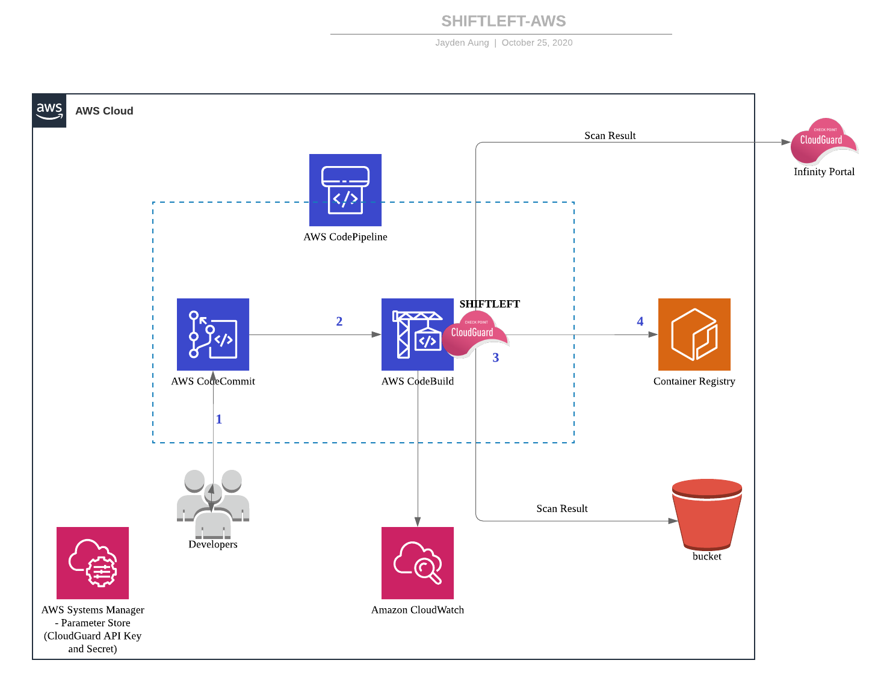
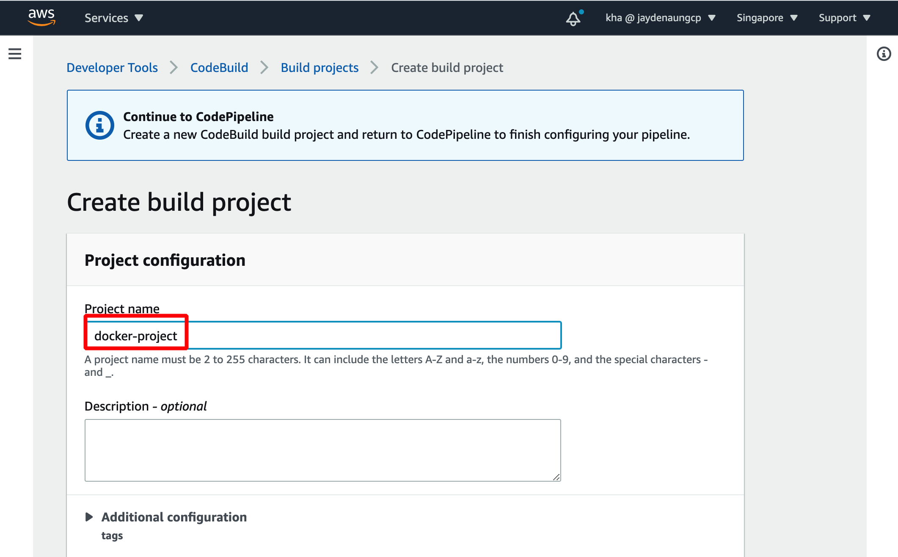
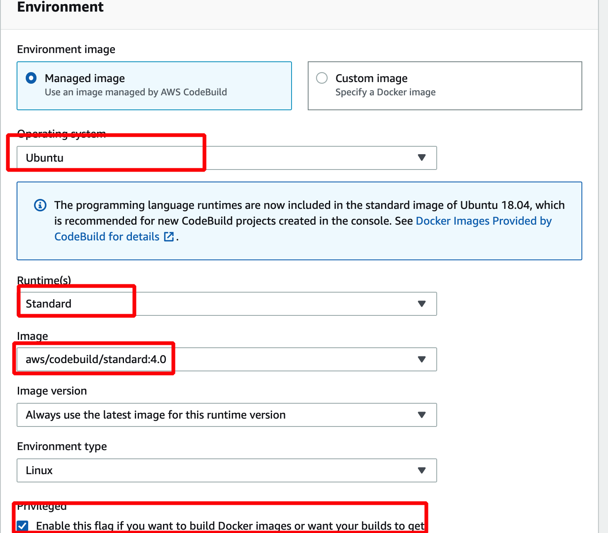
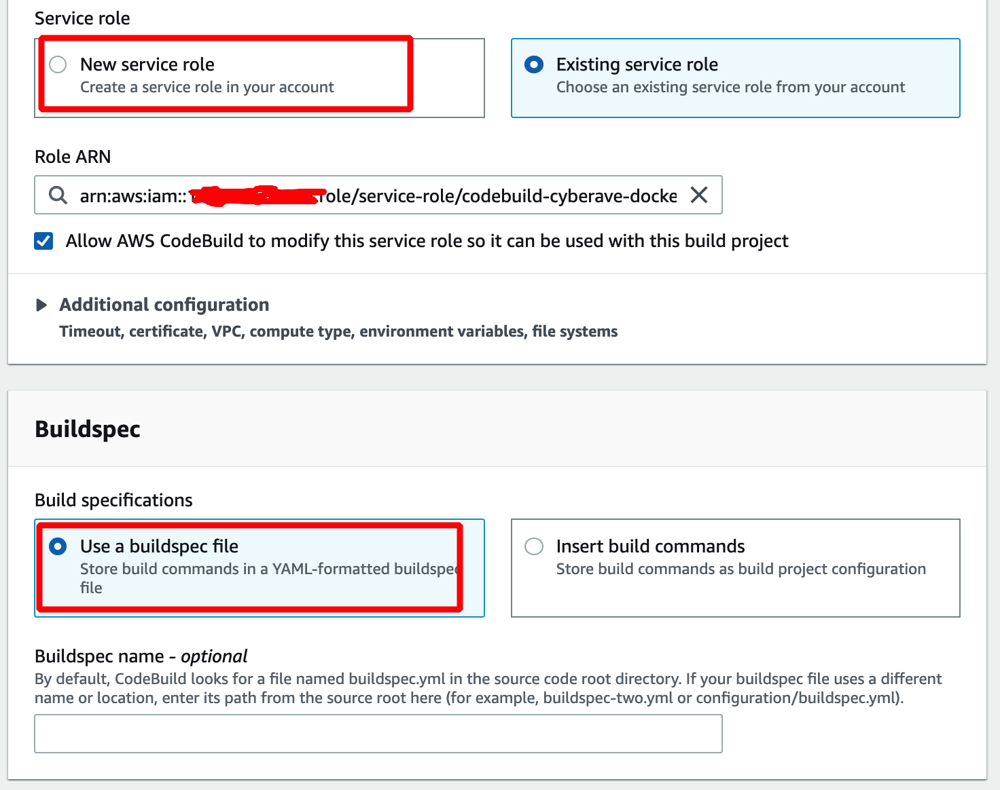
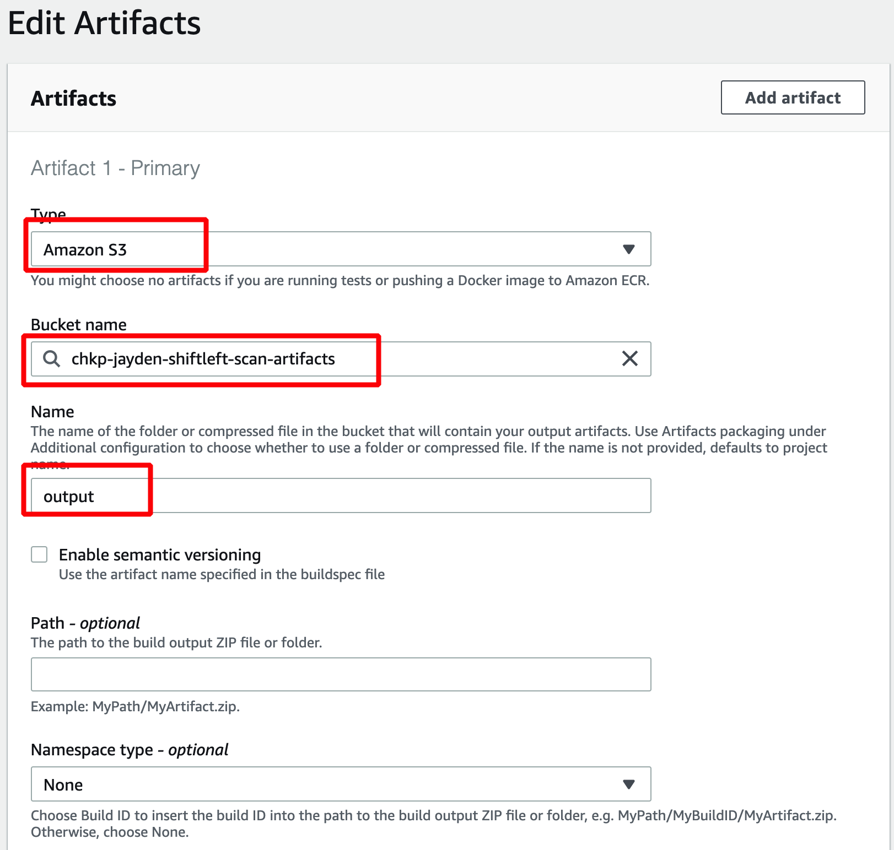
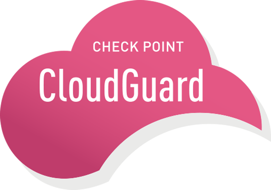

# CloudGuard SHIFTLEFT integration with CICD pipeline on AWS

Docker images often contain vulnerabilities that can allow an attacker to leverage when the application is at runtime - in both UAT/Test and production environments. It's crutial for DevOps engineers to ensure that the security is integrated into CICD Pipeline for your cloud native applications. Check Point's CloudGuard SHIFTLEFT is a security tool that can integrate into your CICD pipeline, and scan your containers for vulnerabilities. Shiftleft can also scan source codes and IaC for vulnerabilities and misconfigurations.

In this tutorial, I'll do a step-by-step walk-through of integrating CloudGuard SHIFTLEFT into your CICD Pipeline on AWS. The integration will happen at the build stage. 

NOTE: This tutorial is **not complete** yet and it is work in progress.


# Pre-requisites
 You need the following tools on your computer:

* AWS CLI [Install AWS CLI](https://docs.aws.amazon.com/cli/latest/userguide/cli-chap-install.html).
* Docker (If you want to test local Docker build)
* [SHIFTLEFT](https://github.com/dome9/shiftleft)

Note: This is an **ALL-AWS** tutorial which means we'll be using CICD services provided by **AWS ONLY**. However, CloudGuard can be integrated with any other automation tools that can create CICD pipeline.

### AWS and CloudGuard 

* AWS Account
* Access to Check Point Infinity portal (For now, the scan result can be viewed only on Infinity portal. Hopefully, we'll make it available on CloudGuard console soon.)

### AWS IAM Roles needed for the following AWS services

- The IAM role(s) will be created as part of creating a CodeBuild project. Please take note that the role used by CodeBulid requires permission to access to a number of AWS resources such as S3. 

- For CodeBuild Role, two additional policies need to be attached to it on top of the IAM policies that were attached when the role was created.

    1. AmazonEC2ContainerRegistryPowerUser 
    2. An Inline Policy that allows it to "PUT OBJECT" to S3 Bucket that you've created. This is for uploading scan result to S3. (See JSON below)

```
{
  "Version": "2012-10-17",
  "Statement": [
    {
      "Sid": "Stmt1602483338347",
      "Action": [
        "s3:PutObject"
      ],
      "Effect": "Allow",
      "Resource": "arn:aws:s3:::[YOUR-BUCKET-ARN]/*"
    }
  ]
}
```

> Please make sure that you UPDATE the resource **ARN** with the **ARN of the S3 bucket** you've created!

# What exactly we will be doing

In this tutorial, we'll be doing the followings;

1. Create an AWS ECR repo \
(Yes if you'd like to follow along my ALL-AWS tutorial, you'll need to create a ECR repo which will store the docker image.)
2. Create a CodeCommit Repo
3. Create a Codebuild Project
4. Test the Codebuild with SHIFTLEFT

## 1. Create an AWS ECR Repository
First you'll need to create a ECR on AWS. Your docker image (after build stage) will be stored in the ECR repo.

You can create the ECR repo on AWS web console or you can just execute the following command.

```bash
aws ecr create-repository --repository-name project-a/my-docker
```

**Take note of the Docker Image URI!You will need it later**

        

## 2. Create a CodeCommit Repository

Then you'll need to create a CodeCommit repo on AWS. We need the CodeCommit repo to store the "source" files that we will build into a docker image later in the tutorial. And the Docker image will then be uploaded to the ECR repo.

 You can create a CodeCommit repo on AWS web console or you can just execute the following command.

```bash
aws codecommit create-repository --repository-name my-docker-repo --repository-description "My Docker Repo"
```

Then you'll need to do 'git clone your CodeCommit repo' via either SSH or HTTP. It'll be an empty repository first. (This CodeCommit will be used to host source codes which we will build into a Docker image.) Then you will need to download the source files (zip) into your local repo [here](https://github.com/jaydenaung/CloudGuard-ShiftLeft-CICD-AWS/blob/main/src.zip) 

- Unzip the source files. You'll need to **make sure that "src" folder and Dockerfile are in the same root directory in order for Docker build to work**.
- Remove the zip file 
- Download the Dockerfile & buildspec.yml 

**So in your CodeCommit local dirctory, you should have the following folder and files**.

1. src (directory where source codes are)
2. Dockerfile
3. buildspec.yml (This file isn't needed for Docker image however, it is required to CodeBuild)

- Then you'll need to do `git init`, `git add -A`, `git commit -m "Your message"` and `git push` (This will upload your local files to  your CodeCommit repository)
- All the above files should now be uploaded to your CodeCommit repo.

> You can also download [shiftleft-binary.zip](https://github.com/jaydenaung/CloudGuard-ShiftLeft-CICD-AWS/blob/main/shiftleft-binary.zip) for shiftleft executables for Windows,Linux and MacOs.

[Check out the how SHIFTLEFT works and command line usage here.](https://github.com/dome9/shiftleft)

## CLOUDGUARD API KEY AND SECRET

SHIFTLEFT requires CloudGuard's API key and API secrets. In Build stage, we'll need to export it in buildspec.yml. You can generate CloudGuard API key and API secrets on CloudGuard console. 

Check out [How to generate CloudGuard API and API Secret](https://supportcenter.checkpoint.com/supportcenter/portal?eventSubmit_doGoviewsolutiondetails=&solutionid=sk144514&partition=General&product=CloudGuard)

***DO NOT HARDCODE YOUR API KEYS AND SECRETS IN BUILDSPEC.YML (IF POSSIBLE)***

It's easier to  hardcode CloudGuard API keys and secrets in the buildspecs.yml. But it is not in line with security best practices. (Think DevSecOps) 

So here is what we are gonna do (The secure way):

* Create two AWS Systems Manager Parameters (SSM) for "CHKP_CLOUDGUARD_ID" and "CHKP_CLOUDGUARD_SECRET".
*  Add "ssm:GetParameter" in-line policy to the IAM role that's used by CodeBuild.
*  We'll instruct buildspec.yml to call the SSM parameters for CloudGuard API and Secrets (instead of hard-coded value) 

### Create SSM Parameters 

1. Go to AWS Management > "Systems Manager"
2. Choose "Parameter Store"
3. Create a parameter for "CHKP_CLOUDGUARD_ID", and key in the your CloudGuard API key. (Choose "String")
4. Create a parameter for "CHKP_CLOUDGUARD_SECRET" and  key in the your CloudGuard Secret. (Choose "String)

> Optionally, you can choose "SecureString" in which chase the string will be encrypted using KMS keys from your account.


### Add an in-line policy to CodeBuild Role

At this stage, Codebuild IAM role is not yet created. So, **Just Remember to add the following in-line policy** to the CodeBuild role when it gets as part of CodeBuild project configuration. This will allow CodeBuild to access to the SSM parameters that we've just created. 

(Of course alternatively, you can create a Codebuild role in advance for you to use at the stage when you create the build project.)

``` bash
{
  "Version": "2012-10-17",
  "Statement": [
    {
      "Sid": "Stmt1603607884407",
      "Action": [
        "ssm:GetParameter"
      ],
      "Effect": "Allow",
      "Resource": "arn:aws:ssm:ap-southeast-1:YOURACCOUNTNO:parameter/CHKP_CLOUDGUARD_ID"
    },
    {
      "Sid": "Stmt1603607963982",
      "Action": [
        "ssm:GetParameter"
      ],
      "Effect": "Allow",
      "Resource": "arn:aws:ssm:ap-southeast-1:YOURACCOUNTNO:parameter/CHKP_CLOUDGUARD_SECRET"
    }
  ]
}
```
> Update resource ARNs with the ARNs of your CloudGuard API Key and Secret. Execute ```get-parameter --name "CHKP_CLOUDGUARD_ID"``` and ```get-parameter --name "CHKP_CLOUDGUARD_SECRET"``` to get the ARNs.

### S3 Bucket
You'll also need to create an S3 bucket to upload and store a copy of SHIFTLEFT vulnerability scan result.

A copy of scan result is uploaded to Check Point Infinity portal (for now). Hopefully, the scan result will be available on CloudGuard (Dome9) portal soon. ***I cannot commit on this***


```bash
aws s3 mb s3://Your-Bucket-Name
```


## [buildspec.yml](https://github.com/jaydenaung/CloudGuard-ShiftLeft-CICD-AWS/blob/main/buildspec.yml)

Buildspec.yml instructs CodeBuild in build stage in terms of what to do. Basically, buildspec.yml will instruct AWS CodeBuild to automatically scan the docker image for vulnerability during build stage. And AWS CodeBuild will follow the steps declared in the buildspec.yml file. So this an **important** configuration file. 

**[IMPORTANT]** In the buildspec.yml, look for **#UPDATE** comments and replace the values with your own values accordingly.

Also in the buildspec.yml you will see that the SHIFTLEFT binary is downloaded from [my lab S3 bucket](https://jaydenstaticwebsite.s3-ap-southeast-1.amazonaws.com/download/shiftleft). It is a Linux x64 executable file and I uploaded it for the purpose of this lab. In your case, you can upload your own SHIFTLEFT binary to your S3 bucket or whichever can host the file. 


```
version: 0.2  
 
phases: 
  install:
    runtime-versions:
        docker: 18     
    commands: 
      - nohup /usr/local/bin/dockerd --host=unix:///var/run/docker.sock --host=tcp://127.0.0.1:2375 --storage-driver=overlay2&
      - timeout 15 sh -c "until docker info; do echo .; sleep 1; done"
  
  pre_build: 
    commands: 
    - echo Logging in to Amazon ECR.... 
    - aws --version
    # update the following line with your own region
    - $(aws ecr get-login --no-include-email --region ap-southeast-1) 
  build: 
    commands: 
    - echo Downloading SHIFTLEFT
    #This instructs CodeBuild to access and use SSM parameters that we've created fro CloudGuard API key and secret 
    - export CHKP_CLOUDGUARD_ID=$(aws ssm get-parameter --name "CHKP_CLOUDGUARD_ID" | jq -r '.Parameter.Value')
    - export CHKP_CLOUDGUARD_SECRET=$(aws ssm get-parameter --name "CHKP_CLOUDGUARD_SECRET" | jq -r '.Parameter.Value')

    #UPDATE the shifleft binary here
    - wget https://jaydenstaticwebsite.s3-ap-southeast-1.amazonaws.com/download/shiftleft
    - chmod -R +x ./shiftleft
    - echo Build started on `date` 
    - echo Building the Docker image... 
    # UPDATE the following line with the name of your own ECR repository
    - docker build -t your-docker-image .
    # UPDATE the following line with the URI of your own ECR repository (view the Push Commands in the console)
    - docker tag YOUR-DOCKER-IMAGE:latest ECR-URI-dkr.ecr.ap-southeast-1.amazonaws.com/YOUR-DOCKER-IAMGE:latest
    #Saving the docker image in tar
    - echo Saving Docker image 
    - docker save chkp-docker -o Your-DOCKER-IAMGE.tar
    # Start Scan
    - echo Starting scan on `date`
    # Update the saved tar file with your docker image name 
    - ./shiftleft image-scan -i Your-DOCKER-IAMGE.tar > result.txt || if [ "$?" = "6" ]; then exit 0; fi
     
  post_build: 
    commands: 
    - echo Build completed on `date` 
    - echo Pushing image to repo
    # UPDATE the following line with the URI of your own ECR repository
    - docker push ECR-URI-dkr.ecr.ap-southeast-1.amazonaws.com/YOUR-DOCKER-IAMGE:latest 

artifacts: 
  files:
    - result.txt
```


# 3. Create a CodeBuild Project

On AWS Console;

1. Go to "CodeBuild" 
2. If you don't already have a codebuild project, choose "Create Project".




3. Add "CodeCommit" as source
4. Choose the CodeCommit repo that you've created earlier.
5. Choose "Master" branch


In CodeBuild windows, do the following;

6. Enter your project name
7. Choose "Managed Image" and "Ubuntu" as Operating system




8. Choose "Standard" & "Standard:4.0" (It's totally up to you to choose actually.)
9. Check "Privileged ...." checkbox
10. Choose an existing role or create a new service role.
**(Add SSM:get-parameter in-line policy to this role!)**


> Now, please take note that codebuild role requires permissions to access to S3 bucket and ECR.




And Finally:

11. Ensure that you configure "Artifacts" **(THIS IS IMPORTANT)**
12. Choose "S3" bucket  & In "Bucket Name", Enter the S3 Bucket that you've created earlier
13. In "Name", Define a folder ***(e.g. output)***



# START THE BUILD!

Now your Codebuild project has been created. You can go to your CodeBuild Project, **"Start the Build"** and observe the build log and output.

### CodeBuild Output

Below is the logs from Codebuild not everything just an excerpt from it - towards the end of the build.

```bash
See any operating system documentation about shared libraries for
more information, such as the ld(1) and ld.so(8) manual pages.
----------------------------------------------------------------------

Build complete.
Don't forget to run 'make test'.

Installing shared extensions:     /usr/local/lib/php/extensions/no-debug-non-zts-20160303/
Installing header files:          /usr/local/include/php/

warning: mbstring (mbstring.so) is already loaded!

find . -name \*.gcno -o -name \*.gcda | xargs rm -f
find . -name \*.lo -o -name \*.o | xargs rm -f
find . -name \*.la -o -name \*.a | xargs rm -f
find . -name \*.so | xargs rm -f
find . -name .libs -a -type d|xargs rm -rf
rm -f libphp.la       modules/* libs/*
Removing intermediate container c9800506bba3
 ---> ecb661b8e7c5
Step 12/14 : RUN a2enmod rewrite
 ---> Running in aace68afc4f0
Enabling module rewrite.
To activate the new configuration, you need to run:
  service apache2 restart
Removing intermediate container aace68afc4f0
 ---> e04362b2faaf
Step 13/14 : RUN a2enmod ssl
 ---> Running in dabd18966a41
Considering dependency setenvif for ssl:
Module setenvif already enabled
Considering dependency mime for ssl:
Module mime already enabled
Considering dependency socache_shmcb for ssl:
Enabling module socache_shmcb.
Enabling module ssl.
See /usr/share/doc/apache2/README.Debian.gz on how to configure SSL and create self-signed certificates.
To activate the new configuration, you need to run:
  service apache2 restart
Removing intermediate container dabd18966a41
 ---> 35cad561b896
Step 14/14 : RUN service apache2 restart
 ---> Running in 867053eb27be
Restarting Apache httpd web server: apache2AH00558: apache2: Could not reliably determine the server's fully qualified domain name, using 172.18.0.2. Set the 'ServerName' directive globally to suppress this message

Removing intermediate container 867053eb27be
 ---> 7fdfbf48c822
Successfully built 7fdfbf48c822
Successfully tagged chkp-docker:latest

[Container] 2020/10/09 08:12:08 Running command docker tag chkp-docker:latest 116489363094.dkr.ecr.ap-southeast-1.amazonaws.com/chkp-docker:latest

[Container] 2020/10/09 08:12:08 Running command echo Saving Docker image
Saving Docker image

[Container] 2020/10/09 08:12:08 Running command docker save chkp-docker -o chkp-docker.tar

[Container] 2020/10/09 08:12:14 Running command echo Starting scan at `date`
Starting scan at Fri Oct 9 08:12:14 UTC 2020

[Container] 2020/10/09 08:12:14 Running command ./shiftleft image-scan -i chkp-docker.tar > result.txt || if [ "$?" = "6" ]; then exit 0; fi
INFO   [09-10-2020 08:12:17.476] blade image-scan updated (0.0.130)           
INFO   [09-10-2020 08:12:17.594] SourceGuard Scan Started!                    
INFO   [09-10-2020 08:12:19.471] Project name: chkp-docker path: /tmp/SourceGuard247824249 
INFO   [09-10-2020 08:12:19.471] Scan ID: 35cad561b8968f02ac5a2e0cb05b1b2fb417b756376dc04164ec5958908d23d8-SvBL8P 
INFO   [09-10-2020 08:12:31.647] Scanning ...                                 
INFO   [09-10-2020 08:12:48.892] Analyzing ...                                

[Container] 2020/10/09 08:14:25 Phase complete: BUILD State: SUCCEEDED
[Container] 2020/10/09 08:14:25 Phase context status code:  Message: 
[Container] 2020/10/09 08:14:25 Entering phase POST_BUILD
[Container] 2020/10/09 08:14:25 Running command echo Build completed on `date`
Build completed on Fri Oct 9 08:14:25 UTC 2020

[Container] 2020/10/09 08:14:25 Running command echo Pushing image to repo
Pushing image to repo

[Container] 2020/10/09 08:14:25 Running command docker push 123456789.dkr.ecr.ap-southeast-1.amazonaws.com/chkp-docker:latest
The push refers to repository [123456789.dkr.ecr.ap-southeast-1.amazonaws.com/chkp-docker]
98d3c49f13ab: Preparing
96fd7149e6a8: Preparing
5c008103b520: Preparing
897144f6e2ff: Preparing
eac34fee20ac: Preparing
c34869bde755: Preparing
bd51b78ec5a5: Preparing
ae9ead4be184: Preparing
36a33866c585: Preparing
4c4801c52898: Preparing
9a078a1d1b01: Preparing
a42cb226a41b: Preparing
0d678d51888b: Preparing
0817436a8f49: Preparing
3385a426f542: Preparing
35c986c7de74: Preparing
53bab0663330: Preparing
606c36b65880: Preparing
ab99fcc1a184: Preparing
9691e5d7a4c7: Preparing
6a4d393f0795: Preparing
e38834ac7561: Preparing
ec64f555d498: Preparing
840f3f414cf6: Preparing
17fce12edef0: Preparing
831c5620387f: Preparing
c34869bde755: Waiting
bd51b78ec5a5: Waiting
ae9ead4be184: Waiting
36a33866c585: Waiting
4c4801c52898: Waiting
9a078a1d1b01: Waiting
a42cb226a41b: Waiting
0d678d51888b: Waiting
0817436a8f49: Waiting
3385a426f542: Waiting
35c986c7de74: Waiting
53bab0663330: Waiting
606c36b65880: Waiting
ab99fcc1a184: Waiting
9691e5d7a4c7: Waiting
6a4d393f0795: Waiting
e38834ac7561: Waiting
ec64f555d498: Waiting
840f3f414cf6: Waiting
17fce12edef0: Waiting
831c5620387f: Waiting
5c008103b520: Pushed
96fd7149e6a8: Pushed
eac34fee20ac: Pushed
c34869bde755: Pushed
98d3c49f13ab: Pushed
bd51b78ec5a5: Pushed
897144f6e2ff: Pushed
4c4801c52898: Pushed
36a33866c585: Pushed
ae9ead4be184: Pushed
0817436a8f49: Layer already exists
3385a426f542: Layer already exists
35c986c7de74: Layer already exists
53bab0663330: Layer already exists
ab99fcc1a184: Layer already exists
606c36b65880: Layer already exists
9a078a1d1b01: Pushed
a42cb226a41b: Pushed
6a4d393f0795: Layer already exists
9691e5d7a4c7: Layer already exists
e38834ac7561: Layer already exists
ec64f555d498: Layer already exists
17fce12edef0: Layer already exists
840f3f414cf6: Layer already exists
831c5620387f: Layer already exists
0d678d51888b: Pushed
latest: digest: sha256:a46642efce16bbed3015725bfd40cbabb2115529ceb0e0a0430ca44b74f8453f size: 5740

[Container] 2020/10/09 08:14:29 Phase complete: POST_BUILD State: SUCCEEDED
[Container] 2020/10/09 08:14:29 Phase context status code:  Message: 
[Container] 2020/10/09 08:14:29 Expanding base directory path: .
[Container] 2020/10/09 08:14:29 Assembling file list
[Container] 2020/10/09 08:14:29 Expanding .
[Container] 2020/10/09 08:14:29 Expanding file paths for base directory .
[Container] 2020/10/09 08:14:29 Assembling file list
[Container] 2020/10/09 08:14:29 Expanding result.txt
[Container] 2020/10/09 08:14:29 Found 1 file(s)

```
Check out that the build has been compeleted.


Finally, you can check and verify that SHIFTLEFT has been integrated into your build stage of the CICD pipeline.


## 4. Check the SHIFTLEFT scan result

On AWS Console, go to "S3", and the S3 bucket that we've created, and defined as "Artifacts" in the CodeBuild stage. In the "output" folder, you should see "result.txt" which basically is the scan result of the SHIFTLEFT. 

**NOTE**
A copy of the result has been sent to Check Point Infinity Portal. If you have access to infinity portal, you can view the scan result on the portal. (Hopefully, this will be available on CloudGuard portal soon)
Otherwise, in result.txt, you can see a number of vulnerabilities found in the docker image!

## A Sample Scan Result (Excerpt)

```
		  CVEs Findings:
			- ID: CVE-2018-21232
			Description: re2c before 2.0 has uncontrolled recursion that causes stack consumption in find_fixed_tags.
			Severity: MEDIUM
			Last Modified: 2020-05-14T12:15:00Z
		- ncurses-base  6.1+20181013-2+deb10u2
		  Severity: MEDIUM
		  Line: 3524
		  CVEs Findings:
			- ID: CVE-2019-17594
			Description: There is a heap-based buffer over-read in the _nc_find_entry function in tinfo/comp_hash.c in the terminfo library in ncurses before 6.1-20191012.
			Severity: MEDIUM
			Last Modified: 2019-12-26T15:35:00Z
			- ID: CVE-2019-17595
			Description: There is a heap-based buffer over-read in the fmt_entry function in tinfo/comp_hash.c in the terminfo library in ncurses before 6.1-20191012.
			Severity: MEDIUM
			Last Modified: 2019-12-23T19:26:00Z
		- libbrotli1  1.0.7-2
		  Severity: MEDIUM
		  Line: 1350
		  CVEs Findings:
			- ID: CVE-2020-8927
			Description: A buffer overflow exists in the Brotli library versions prior to 1.0.8 where an attacker controlling the input length of a "one-shot" decompression request to a script can trigger a crash, which happens when copying over chunks of data larger than 2 GiB. It is recommended to update your Brotli library to 1.0.8 or later. If one cannot update, we recommend to use the "streaming" API as opposed to the "one-shot" API, and impose chunk size limits.
			Severity: MEDIUM
			Last Modified: 2020-09-30T18:15:00Z
		- util-linux  2.33.1-0.1
		  Severity: UNKNOWN
		  Line: 3899
		  CVEs Findings:
			- ID: CVE-2007-5191
			Description: mount and umount in util-linux and loop-aes-utils call the setuid and setgid functions in the wrong order and do not check the return values, which might allow attackers to gain privileges via helpers such as mount.nfs.
			Severity: UNKNOWN
			Last Modified: 2018-10-15T21:41:00Z
			- ID: CVE-2001-1494
			Description: script command in the util-linux package before 2.11n allows local users to overwrite arbitrary files by setting a hardlink from the typescript log file to any file on the system, then having root execute the script command.
			Severity: UNKNOWN
			Last Modified: 2017-10-11T01:29:00Z
		- m4  1.4.18-2
		  Severity: UNKNOWN
		  Line: 3407
		  CVEs Findings:
			- ID: CVE-2008-1688
			Description: Unspecified vulnerability in GNU m4 before 1.4.11 might allow context-dependent attackers to execute arbitrary code, related to improper handling of filenames specified with the -F option.  NOTE: it is not clear when this issue crosses privilege boundaries.
			Severity: UNKNOWN
			Last Modified: 2017-08-08T01:30:00Z
			- ID: CVE-2008-1687
			Description: The (1) maketemp and (2) mkstemp builtin functions in GNU m4 before 1.4.11 do not quote their output when a file is created, which might allow context-dependent attackers to trigger a macro expansion, leading to unspecified use of an incorrect filename.
			Severity: UNKNOWN
			Last Modified: 2017-08-08T01:30:00Z
Please see full analysis: https://portal.checkpoint.com/Dashboard/SourceGuard#/scan/image/35cad561b8968f02ac5a2eabcderdfdkfndkfndk 
```

**CONGRATULATIONS!!!** You've successfully integrated CloudGuard SHIFTLEFT into CICD pipeline on AWS!

Happy DevSecOps-ing!
Jayden Aung

## Issues

1. One of the issues you might probably encounter in Build is the build stage might fail due to IAM insufficient permissions. Ensure that the IAM role has the sufficient permissions attached to it
 

 

## Resources

1. [CloudGuard SHIFTLEFT](https://github.com/dome9/shiftleft)

2. Here is another good tutorial you might want to check out - [CloudGuard integration with Jenkins by Dean Houari](https://github.com/chkp-dhouari/CloudGuard-ShiftLeft-CICD)